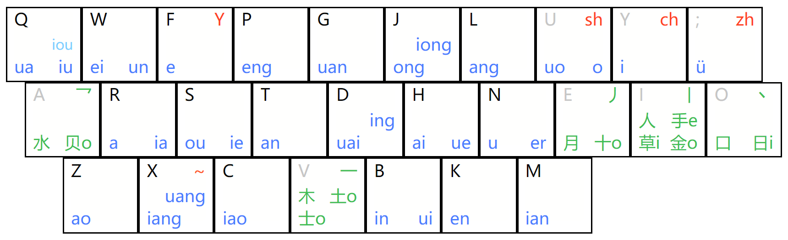

# 键道27C Flow（音码 + 形码筛选 + 顶功）

星空键道27C 的**纯音码**方案：只保留音码（声母 + 韵母，一字两码），
词组用键道原版简码，配合 **形码筛选/纯笔码** 与 **顶功**：

* 单字：2 键全码 + 1 键声母码；
* 2 字词：音音全码（`wumk` → 我们）；
* 3 字词：3 个首字母（`wum` → 为什么）；
* 4 字词：4 个首字母（`wlyy` → 万里长城）；
* 5 字以上：前 3 首 + 末 1 首（`yfq;` → 吃一堑长一智）；
* 形码 `aeiov` 跟在音码后筛选（末字完整、前面各字一省）；
* 纯形码（笔码）：只打 `aeiov` 时直接查纯形码表（shape）（`a`→又、`ai`→阝、`aaa`→巛），
  没有匹配时回车原样上屏；
* 顶功：4 码后 / 形码后再按音码键自动上屏。

* `rime_jd27c`：原版键道27C（音码 + 形码、顶功）
* 本项目：标准词库 + 手动调序（`-`/`=`）

## 布局

声母、韵母沿用键道27C（Colemak 键位）：



### 声母

| 键 | `;` | `y` | `u` | `f` | `w` | 其它字母 |
|----|-----|-----|-----|-----|-----|----------|
| 声母 | zh | ch | sh | f、y | w | 同字母 |

### 韵母

| 键 | `r` | `u` | `f` | `y` | `n` | `;` | `h` | `w` | `b` | `z` | `s` | `q` |
|----|-----|-----|-----|-----|-----|-----|-----|-----|-----|-----|-----|-----|
| 韵母 | a、ia | o、uo | e | i | u、er | ü | ai、ue | ei、un | in、ui | ao | ou、ie | iu、ua |

| 键 | `t` | `k` | `l` | `p` | `j` | `c` | `d` | `m` | `x` | `g` |
|----|-----|-----|-----|-----|-----|-----|-----|-----|-----|-----|
| 韵母 | an | en | ang | eng | ong、iong | iao | ing、uai | ian | iang、uang | uan |

零声母用 `x`（如 爱 ai → `xh`）。

> 说明：键道音码本身就有合并，例如 y 声母与 f 声母同键
> （呀 ya 与 发 fa 都是 `fr`），零声母与 x 声母同键
> （学 xue 与 爱 ai 都是 `xh`）。原版键道靠形码区分这些同码；
> 本方案只能靠词库和词频来选。这是纯音码方案的固有代价。

## 编码

`s` = 声母键，`y` = 韵母键。词组用键道原版简码：

| 字数 | 编码 | 例 |
|-----:|------|-----|
| 1 | `sy`（全码，另加 1 键声母码）| 人 `rk` / `r` |
| 2 | 音音全码 | 我们 `wu mk` |
| 3 | 3 个首字母 | 为什么 `w u m` |
| 4 | 4 个首字母 | 万里长城 `w l y y`；人工智能 `r g ; n` |
| ≥5 | 前 3 首 + 末 1 首 | 吃一堑长一智 `y f q ;`；中华人民共和国 `; h r g` |

配上形码（见下节）：

* 贺礼：`hfly` + `aoaaa` → 贺礼；
* 哈基米：`hjm` + `ovoevv` → 哈基米。

顶功：音码满 4 键后，再按音码键自动上屏当前候选；形码后同样。
整句输入不再追求一次成句，而是像原版键道一样逐词上屏。

## 形码（b 键）

`a e i o v` 是五种笔形，不属于音码：

| 键 | `v` | `i` | `e` | `o` | `a` |
|----|-----|-----|-----|-----|-----|
| 笔形 | ㇐（横）| 丨（竖）| 丿（撇）| 丶（点）| 乛（折）|

* 形码跟在音码后面。设音码解出 n 个字，候选的期望形码串 = **前 n-1 个字
  各取首键 + 最后一个字的完整形码**；typed shape 取其前缀。
  单字（n=1）自然就是整字完整形码，不用特判。
* 例：
  * 贺礼 `hfly`：`a` + 礼 `oaaa` = `aoaaa` → `hflyao` / `hflyaoaaa`；
  * 哈基米 `hjm`：`o` + `v` + 米 `oevv` = `ovoevv` → `hjmov` … `hjmovoevv`；
  * 不醒 `bnxd`：`v` + 醒 `vioi` = `vvioi` → `bnxdvv` / `bnxdvvioi`；
  * 单字：`my` + `oevv` → 米。
* 逐步筛选：每多一个音码或形码键，会排除所有更短前缀当时的首选
  （含无形码的 base 和更短的音码前缀），首选项一路往后走，方便连续细选。
  例：`hjm`→好久没，`hjmo`→喊救命，`hjmov`→哈基姆，`hjmovo`→哈基米；
  声码同样：`h`→或、`hu`→和；形码第一笔也生效：`fguk`→原神、`fgukv`→元神。
  （喊救命 本身也满足 `ov`，这里被主动排除；BackSpace 会恢复）。
  全被排除时回退显示，不会空菜单。
* **顶功**：
  * 音码满 4 键后，再按音码键先上屏当前候选（四码自动上屏）；
    若这 4 键没有候选，则按键继续延长，不打断 5/7 键节奏码；
  * 形码后再按音码键先上屏（顶码自动上屏）；
* BackSpace 先删形码，再删音码；
* 回车原样上屏输入的字母（音码 + 已输形码），不走候选。

形码的数据来自 `ZiDB` 的前 4 个笔形（`xkjd27c_flow.shape.txt`），
由 `lua/flow_shape.lua`（取键、顶功）+ `lua/flow_filter.lua`（筛选、显示）
处理。

### 纯笔码（只打 aeiov）

输入串里还没有音码（只有 `aeiov`）时，形码键不再进入筛选，而是作为
**纯笔码输入**直接查纯形码表（shape，来自原版键道 `buchong` 的「形简 / 补充提示 /
部首偏旁」三段）：

* `a` → 又、乛、氵…；`v` → 有、木、土…；`ai` → 阝、卩、丩、凵…；`aaa` → 巛；
* 可以连打：`ae` → 又得、`aiv` → 阝有；
* 保持原表顺序、不发音码/形码候选提示；
* 手动词序照常：`-` 把候选提到本级首位、`=` 在本级内下移；
* 没有匹配（或想直接输入字母）时按回车，原样上屏输入的字母串。

纯形码表在 `xkjd27c_flow.shape.dict.yaml`，由 `tools/build_flow_dict.py` 生成，
两个词库变体都 import 它。

## 安装

1. 把 `rime/` 下的文件和 `lua/flow_filter.lua` 复制到 Rime 用户目录：

   | 平台 | 用户目录 |
   |------|----------|
   | Linux / fcitx5 | `~/.local/share/fcitx5/rime/` |
   | Linux / ibus | `~/.config/ibus/rime/` |
   | Windows / 小狼毫 | `%APPDATA%\Rime` |
   | macOS / 鼠须管 | `~/Library/Rime` |

   ```
   xkjd27c_flow.schema.yaml
   xkjd27c_flow.ice.dict.yaml    # 默认词库（rime-ice，88 万词）
   xkjd27c_flow.simp.dict.yaml   # 小词库（pinyin_simp，4.8 万词）
   xkjd27c_flow.danzi.dict.yaml  # 单字（两个变体共用）
   xkjd27c_flow.shape.dict.yaml   # 纯形码表（shape，两个变体共用）
   xkjd27c_flow.shape.txt        # 期望形码表（ZiDB 前 4 笔形）
   lua/flow_filter.lua           # 节奏校验 + 形码筛选 + 自动前进 + 候选提示
   lua/flow_shape.lua            # 形码键处理 + 顶功
   lua/flow_shapes.lua           # 期望形码串
   lua/flow_order.lua            # 手动调序存储（leveldb/txt）
   lua/flow_codes.lua            # 候选音码推导（reverse db + 单字表权重，用于提示）
   ```

   默认用 `.ice`（rime-ice，词多、现代）。想换成 `.simp`（pinyin_simp，小、Rime 自带）
   就在 `xkjd27c_flow.custom.yaml` 里 patch：

   ```yaml
   patch:
     translator/dictionary: xkjd27c_flow.simp
   ```

   调序数据两个变体共用（`flow_order/name: xkjd27c_flow.order`），切词库不丢 pin。

2. 在 `default.custom.yaml`（没有就新建）里加入方案，例如：

   ```yaml
   patch:
     schema_list:
       - schema: xkjd27c_flow
   ```

3. 重新部署（fcitx5 可重启输入法或「重新部署」）。

## 使用

* 单字 2 键；2 字词音音 4 键；3/4 字词首字母；5 字以上前三首 + 末一首。
* 形码 `aeiov` 跟在音码后面，按「前 n-1 首键 + 末字完整形码」筛选：
  `hjmo` → 哈基米。
* **纯笔码**：只按 `aeiov` 时直接查纯形码表（shape）（`a`→又、`ai`→阝、`aaa`→巛），
  回车原样上屏。
* **顶功**：4 码后再按音码键自动上屏；形码后再按音码键自动上屏。
* 例：`wlyy` → 万里长城；`yfq;` → 吃一堑长一智（不首选时用形码收窄）。
* **手动调序**：候选上按 `-` 上调、`=` 下调（见下节），不依赖词频学习。
* **候选提示**：非首选候选右侧显示「让它成为首选还需要按的键」——
  声码没输完补声码（`h`→好 `z`、会 `b`、和 `f`），
  输完则给形码（`hjmo`→哈基米 `vo`、`hjmov`→喊救命 `iv`）；
  多音字按单字表里权重最高的读音补全（`l`→了 `f`，不是 `c`）；
  只给前 20 个候选算提示（提示要模拟筛选，候选多了耗时；
  翻页更深时需要提示的话可以 `flow_hint_limit: 0` 改为不限）；
  可用 `flow_hint: false` 关闭。
* 翻页：`[` / `]`。
* 简繁切换：F7（默认简体）。
* 中英、全半角：Shift 或开关切换。

## 手动调序（替代自动调频）

用户词典学习默认关闭（`enable_user_dict: false`），候选顺序由用户显式调整：

* `-`（上调/降档）：把当前候选 pin 到更短一级的 key，并将输入降一档：
  `hjmovo` → `hjmov` → `hjmo` → `hjm`；
  同时从原来那一级移走 pin，所以只在最终调到的级别生效（不会在中途的级别留 pin）。
  到最短（无形码）后，**单字全码（声韵，2 键）还能再削到 1 键简码**，
  输入也变短，完整音节会记进 order：

  ```
  n 那           （一简码）
  ny- 你         把「你」pin 到 n，leveldb 记成「你 ny」
  nyaa--- 泥     经过 nya -> ny|a -> ny -> n，把「泥」pin 到 n
  ```

  若目标级别已被其他候选占据，被顶掉的候选会沿它**自己的形码串**顺延到下一级
  （继续冲突则继续顺延，直到有空位或形码用完）：

  ```
  输入 hjmovo--   哈基米 pin 到 hjmo
  输入 hjmov-     喊救命 pin 到 hjmo
  → hjmo=哈基米、hjmov=喊救命；原来 hjmov 上的候选继续顺延
  ```

  可用 `flow_order/displace: false` 关闭顺延（被顶掉的候选留在原位后面）。
* `=`（升档/下调）：
  * 在 1 键简码级别，优先用 pin 时记下的完整音节还原（`n`→`ny`，
    如 `n=` 把「你」还原到 `ny`，输入回到 `ny`）；
  * 没有记录（没 pin 过/手动改过库）则回退反查单字码，找回完整音节；
  * 其它情况：给当前候选**补上下一笔形码**并 pin 到更长一级，保持当前候选：
    `hjm` → `hjmo` → `hjmov` → … → `hjmovoevv`（完整形码）；
  * 同时把该候选从**更短一级**的 pin 列表里移走，所以不会把 `hjm` 锁死；
  * 已到完整形码后，再按 `=` 则在该 key 内下移一位。
* 其余候选跟在其后，保持原顺序；
* 数据默认存 leveldb：`xkjd27c_flow.order.userdb`（单键写入，查询走内存）；
  调试可切纯文本后端，方便手改：

  ```yaml
  # xkjd27c_flow.custom.yaml
  patch:
    flow_order/backend: txt
  ```

  文本文件为 `xkjd27c_flow.order.txt`（`key\t候选1\t候选2`，key 形如 `hjm|ov`；
  音码削减过的候选写作 `候选 完整音节`，如 `n|\t你 ny`）。
* 顶替顺延：默认开启（`flow_order/displace: true`）；关闭则 `-` 直接插到目标 key 首位，
  被顶掉的候选留在原位后面：

  ```yaml
  # xkjd27c_flow.custom.yaml
  patch:
    flow_order/displace: false
  ```

* 清空调序：删掉对应的 DB 目录/文本文件即可。

## 码表生成

`rime/` 里已经生成好两份词库，直接用即可：

* `xkjd27c_flow.ice.dict.yaml`：默认词库（rime-ice，约 88 万词）；
* `xkjd27c_flow.simp.dict.yaml`：小词库（pinyin_simp，约 4.8 万词）；
* `xkjd27c_flow.danzi.dict.yaml`：单字（两个变体共用，import）；
* `xkjd27c_flow.shape.dict.yaml`：纯形码表（shape，两个变体共用，import）；
* `xkjd27c_flow.shape.txt`：期望形码表。

需要重新生成时（**一次生成两个变体**）：

```
git clone --depth 1 https://github.com/iDvel/rime-ice /tmp/rime-ice
python3 tools/build_flow_dict.py
```

数据源：

* `../rime_jd27c`：单字表 `ZiDB`（键道定音、音码、笔形）；
* `/usr/share/rime-data/pinyin_simp.dict.yaml`：`simp` 词库；
* `/tmp/rime-ice/cn_dicts` 的 8105 + base/ext/others：`ice` 词库
  （目录不存在时只重新生成 `simp`）。

单字权重按**读音**取（如 `见 jian=3460998 / 见 xian=34609`）；词库没给的
读音按键道短码长度衰减兜底（每长一码低一个数量级），避免多音字的罕见
读音继承常用读音的字频——例如 `xm` 的首选是 先 而不是 见。

常用参数：

```
--source PATH          rime_jd27c 仓库路径
--pinyin-simp PATH     pinyin_simp.dict.yaml 路径
--words PATH           追加标准拼音词库（词/拼音/权重），可重复；两个变体都加
--rime-ice DIR         rime-ice 仓库路径（默认 /tmp/rime-ice）
--rime-ice-tencent     再引入 rime-ice tencent（无拼音，自动注音）
--no-align-original    不按原版 1 键/2 键首选调整单字权重
--abbrev-weight FLOAT  节奏码词频系数（默认 1.0）
--initial-weight FLOAT 1 键声母码词频系数（默认 1.0）
--weight-scale FLOAT   全局词频缩放（默认 1）
--out PATH             输出目录（默认 rime/）
```

生成规则：

* 单字：键道音码全码 + 1 键声母码；词频取字频源。
* 单字首选对齐原版：读原版 `xkjd27c.danzi` 里 code 恰好 1/2 键的条目
  （一简 / 全码），把该字权重抬到同码第一，保证 `l`→了、`lf`→乐、
  `wu`→握 这类默认首选与原版一致；清单见 `docs/orig-first.txt`。
* 词组（键道原版简码）：
  * 2 字：音音全码（我们 → `wu mk`）；
  * 3 字：3 个首字母（为什么 → `w u m`）；
  * 4 字：4 个首字母（万里长城 → `w l y y`）；
  * 5 字以上：前 3 首 + 末 1 首（吃一堑长一智 → `y f q ;`）。
* 码表 code 用**空格分隔音节**，prism 音节表很小（几百项），
  整词由音节序列组成；不要写成长串，否则大数据量时 prism 会爆炸。
* 两份词库（`.ice` / `.simp`）都 import 共用单字表 `xkjd27c_flow.danzi`；
  切换只需改 `translator/dictionary`。
* 纯形码表（shape）：从原版 `xkjd27c.buchong.dict.yaml` 提取 code 全为 `aeiov` 的条目
  （「形简 / 补充提示 / 部首偏旁」），保持原顺序生成
  `xkjd27c_flow.shape.dict.yaml`；两个变体都 import 它。
* 形码不进码表：另生成 `xkjd27c_flow.shape.txt`（ZiDB 前 4 笔形，
  8 千余字），运行时由 Lua 用来筛选候选。

## 测试

`tools/rime_probe.c` 是一个无 GUI 的 librime 测试器，可以直接验证
切分、候选与用户词典学习：

```
cc tools/rime_probe.c -I/path/to/librime/src -o /tmp/rime_probe \
   /usr/lib64/librime.so.1 -Wl,-rpath,/usr/lib64

mkdir -p /tmp/rime_flow_test/lua && cp rime/xkjd27c_flow.*.yaml \
    rime/xkjd27c_flow.shape.txt /tmp/rime_flow_test/
cp rime/lua/*.lua /tmp/rime_flow_test/lua/
ln -s /usr/share/opencc /tmp/rime_flow_test/opencc
printf 'patch:\n  schema_list:\n    - schema: xkjd27c_flow\n' \
    > /tmp/rime_flow_test/default.custom.yaml

/tmp/rime_probe /tmp/rime_flow_test          # 跑内置测试
/tmp/rime_probe /tmp/rime_flow_test wum      # 指定按键
/tmp/rime_probe /tmp/rime_flow_test rk 2     # 选第 2 个候选上屏（学词）
```

## 与原版键道27C 的区别

|            | xkjd27c        | xkjd27c_flow        |
|------------|----------------|---------------------|
| 编码       | 音码 + 形码    | 纯音码 + 形码筛选（词组沿用键道原版简码）|
| 输入方式   | 顶功（打满一键上屏） | 逐词上屏（四码 / 形码顶功）|
| 同码区分   | 形码参与编码   | 形码筛选 + 词频 + 纯笔码查表 |
| 词频学习   | 用户词典       | 默认关闭，改手动 `-`/`=` 调序 |
| 词库       | 键道词库       | 标准拼音词库（rime-ice / pinyin_simp）|

## 目录

```
rime/     Rime 方案、词库（.ice 默认 / .simp）、单字表、纯形码表（shape）、期望形码表
rime/lua/ 节奏校验、形码筛选 / 顶功（Lua）
tools/    码表生成脚本、librime 测试器
docs/     布局图、设计记录（cadence.md）、原版首选清单（orig-first.txt）
```

## 致谢与许可

* 星空键道原作者：吅吅大山（[键道6官网](https://xkinput.gitee.io/)）
* 布局与单字读音来自 [rime_jd27c](https://github.com/TsFreddie/rime_jd27c)
* 词库 `xkjd27c_flow.ice` 派生自 [rime-ice](https://github.com/iDvel/rime-ice)
  （GPLv3），`xkjd27c_flow.simp` 派生自 Rime 自带的 `pinyin_simp`。

因为分发了 rime-ice 派生词库，本方案整体采用 **GPL-3.0**（见 `LICENSE`）。
